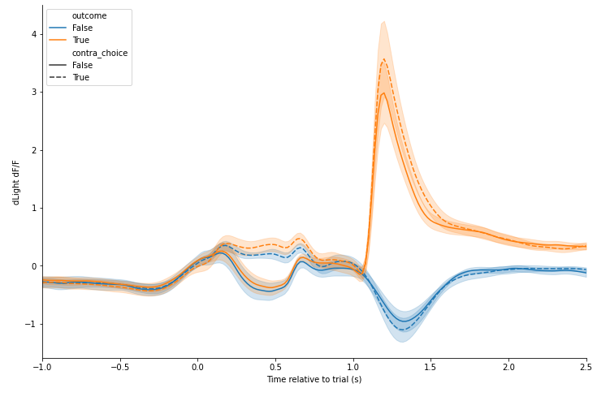

# Photometry analysis

This repository contains code for analysing photometry data from behavioural tasks with a discrete trial structure.  

The [photometry_analysis](/code/photometry_analysis.ipynb) jupyter notebook is a tutorial illustrating the analysis pipelines using example data in the [data](/data) directory.    The data organisation and preprocessing pipeline used to generate this data is in the [data_organisation](https://github.com/cognitive-circuits/data_organisation/) repository.

The [code/analysis](/code/analysis) folder contains the same code as the notebook but organized into modules to facilitate maintainability and reuse.  The [analysis_script](/code/analysis_script.py) uses these modules to implement the same steps as the jupyter notebook.

